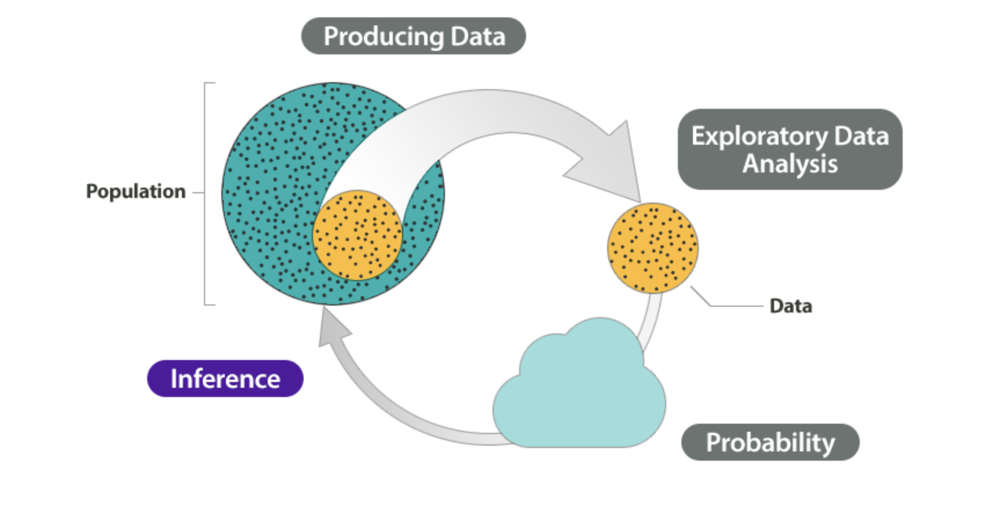
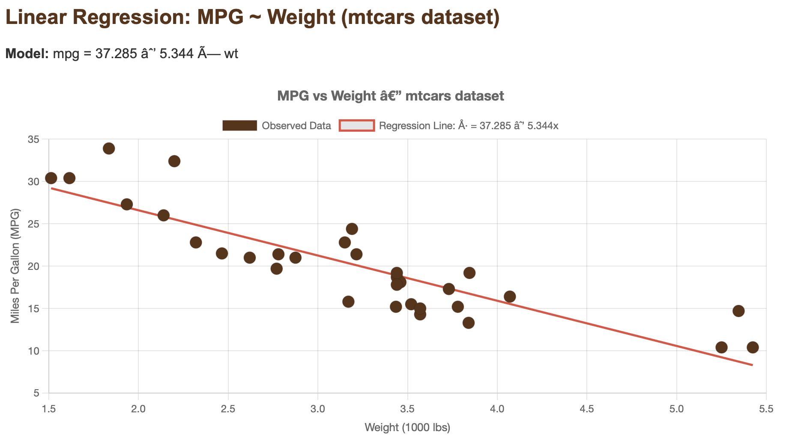

## Calculus

::::: grid
::: {.g-col-12 .g-col-md-2}

:::
::: {.g-col-12 .g-col-md-10}
**University of Minnesota Duluth, Department of Mathematics and Statistics**\
**Teaching Assistant**\
[Fall 2025](#) 

[Spring 2026](#)

A two-semester sequence covering limits, derivatives, and applications of differentiation in Calculus I, followed by integration techniques, sequences, series, and applications in Calculus II.
:::
:::::

## Differential Equation

::::: grid
::: {.g-col-12 .g-col-md-2}

:::
::: {.g-col-12 .g-col-md-10}
**University of Minnesota Duluth, Department of Mathematics and Statistics**\
**Instructor**\
[Fall 2025](#) 

[Spring 2026](#)

An undergraduate course covering first and second order ordinary differential equations, systems of differential equations, and series solutions with applications to mathematical modeling using Mathematica and Python.
:::
:::::

## Statistical Inference

::::: grid
::: {.g-col-12 .g-col-md-2}

:::
::: {.g-col-12 .g-col-md-10}
**University of Ghana, Department of Statistics and Actuarial Science**\
**Teaching Assistant**\
[Summer 2023](#)

[Spring 2024](#)

Covers fundamental principles of statistical inference including point estimation, 
hypothesis testing, confidence intervals, and Bayesian methods.
:::
:::::

## Introduction to Biostatistics

::::: grid
::: {.g-col-12 .g-col-md-2}

:::
::: {.g-col-12 .g-col-md-10}
**University of Ghana, Department of Statistics and Actuarial Science**\
**Teaching Assistant**\
[Spring 2024](#)

An introductory course covering fundamental concepts in biostatistics including study design, descriptive statistics, probability distributions, hypothesis testing, and survival analysis applied to public health and medical research.
:::
:::::

## Advanced Linear Regression

::::: grid
::: {.g-col-12 .g-col-md-2}

:::
::: {.g-col-12 .g-col-md-10}
**University of Ghana, Department of Statistics and Actuarial Science**\
**Teaching Assistant**\
[Summer 2023](#)

An advanced course covering simple and multiple linear regression, model building strategies, variable selection, multicollinearity, residual diagnostics, and remedial measures with applications using real datasets.
:::
:::::

## Decision Theory

::::: grid
::: {.g-col-12 .g-col-md-2}

:::
::: {.g-col-12 .g-col-md-10}
**University of Ghana, Department of Statistics and Actuarial Science**\
**Teaching Assistant**\
[Spring 2024](#)

A course exploring the mathematical foundations of decision making under uncertainty, covering game theory, risk analysis, and statistical decision rules including Bayes and minimax criteria.
:::
:::::

---
