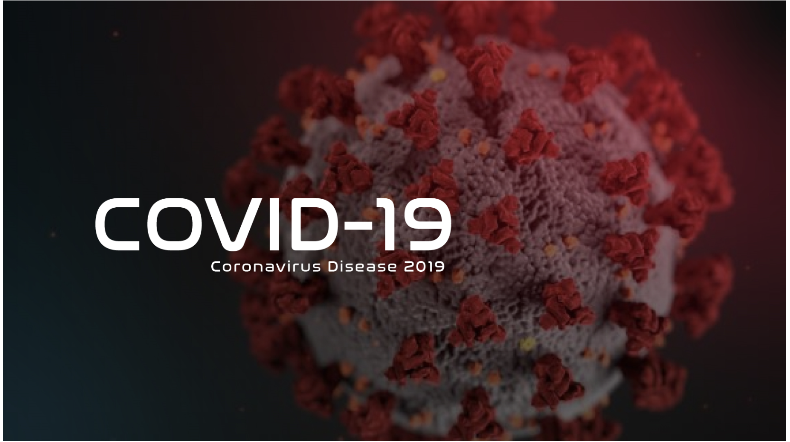
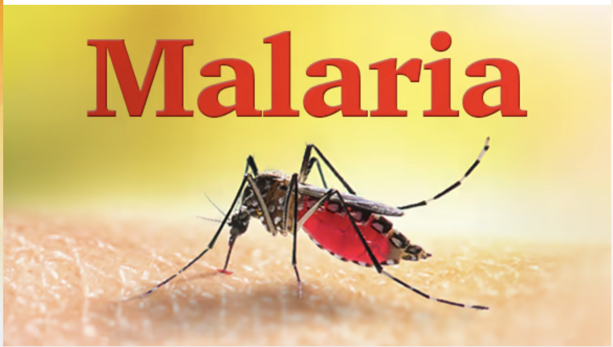

## Health & Epidemiology

```{=html}
<div class="project-grid">

  <a class="quarto-grid-item" href="https://bernardkwabenaappiah.shinyapps.io/covid_app/">
    
    <div class="card-title"><strong>COVID-19 US Interactive Dashboard</strong></div>
    <div class="card-description">An interactive Shiny dashboard visualizing COVID-19 cases, deaths, and vaccination rates across all 50 US states from 2020-2023 with spatial mapping.</div>
  </a>

  <a class="quarto-grid-item" href="https://drive.google.com/file/d/1tJiNxEV0WKWdas6gD1m5kI4U_NJCKVGs/view?usp=sharing">
    
    <div class="card-title"><strong>A Machine Learning Approach to Identifying Malaria Risk Factors Among Pregnant Women in Ghana</strong></div>
    <div class="card-description">Applied Random Forest, Decision Tree, Naïve Bayes, and KNN to identify malaria risk factors among pregnant women using the 2019 Ghana Malaria Indicator Survey.</div>
  </a>

</div>
```
